First R Markdown with movie rating data
---------------------------------------

-   Read data

``` r
movies <- read.csv('data/Movie Ratings.csv',header=T)
```

``` r
summary(movies)
```

    ##      Film              Genre           Rotten.Tomatoes.Ratings..
    ##  Length:562         Length:562         Min.   : 0.0             
    ##  Class :character   Class :character   1st Qu.:25.0             
    ##  Mode  :character   Mode  :character   Median :46.0             
    ##                                        Mean   :47.4             
    ##                                        3rd Qu.:70.0             
    ##                                        Max.   :97.0             
    ##  Audience.Ratings.. Budget..million... Year.of.release
    ##  Min.   : 0.00      Min.   :  0.0      Min.   :2007   
    ##  1st Qu.:47.00      1st Qu.: 20.0      1st Qu.:2008   
    ##  Median :58.00      Median : 35.0      Median :2009   
    ##  Mean   :58.83      Mean   : 50.1      Mean   :2009   
    ##  3rd Qu.:72.00      3rd Qu.: 65.0      3rd Qu.:2010   
    ##  Max.   :96.00      Max.   :300.0      Max.   :2011

\* change the column names
--------------------------

``` r
colnames(movies) <- c('name','genre','criticsratings','audienceratings','budgetmillions','releaseyear')
```

To see the types of genre
-------------------------

``` r
levels(movies$genre)
```

    ## NULL

``` r
head(movies)
```

    ##                    name     genre criticsratings audienceratings budgetmillions
    ## 1 (500) Days of Summer     Comedy             87              81              8
    ## 2           10,000 B.C. Adventure              9              44            105
    ## 3            12 Rounds     Action             30              52             20
    ## 4             127 Hours Adventure             93              84             18
    ## 5             17 Again     Comedy             55              70             20
    ## 6                  2012    Action             39              63            200
    ##   releaseyear
    ## 1        2009
    ## 2        2008
    ## 3        2009
    ## 4        2010
    ## 5        2009
    ## 6        2009

changing the numeric column to categorical
------------------------------------------

``` r
movies$releaseyear<-as.factor(movies$releaseyear)
levels(movies$releaseyear)
```

    ## [1] "2007" "2008" "2009" "2010" "2011"

ggplot2 package
---------------

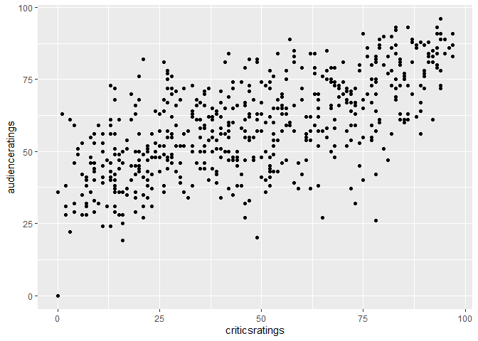

color and size setting
----------------------

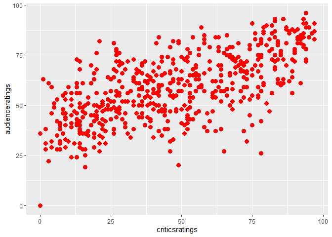

Color and Size mapping
----------------------

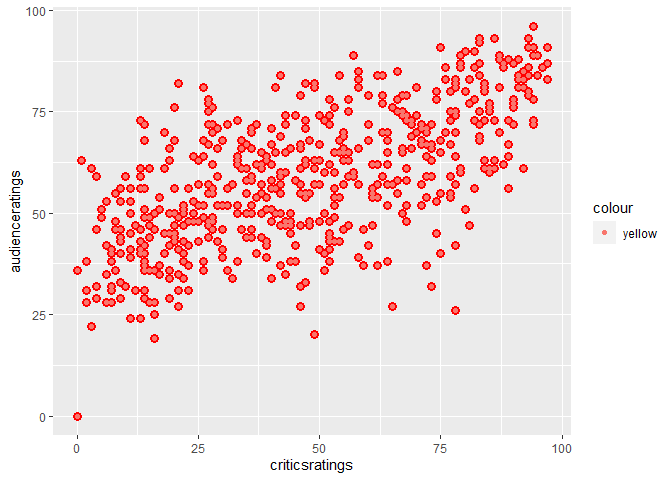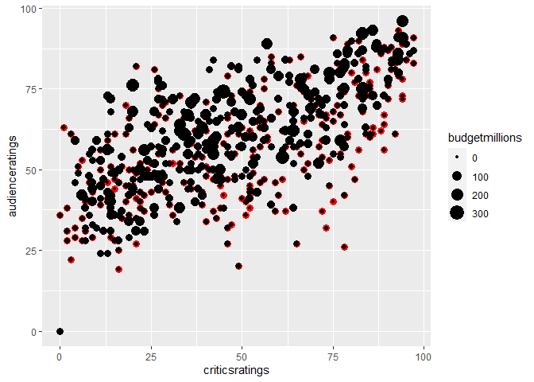

changing the graph type
-----------------------

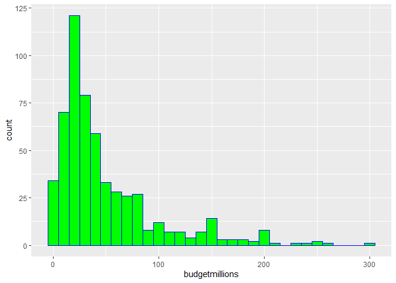

genre mappig
------------

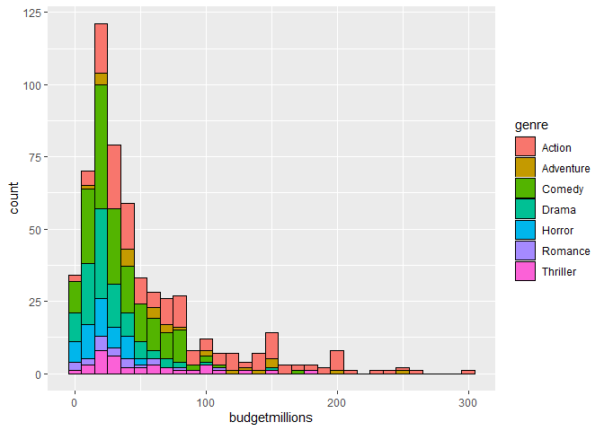

Using facet grid to divide the graph according to genre
-------------------------------------------------------

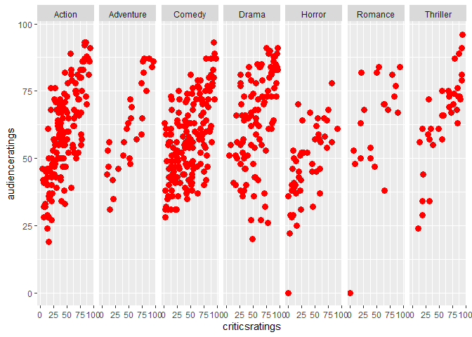

    ## Warning: Ignoring unknown parameters: stack

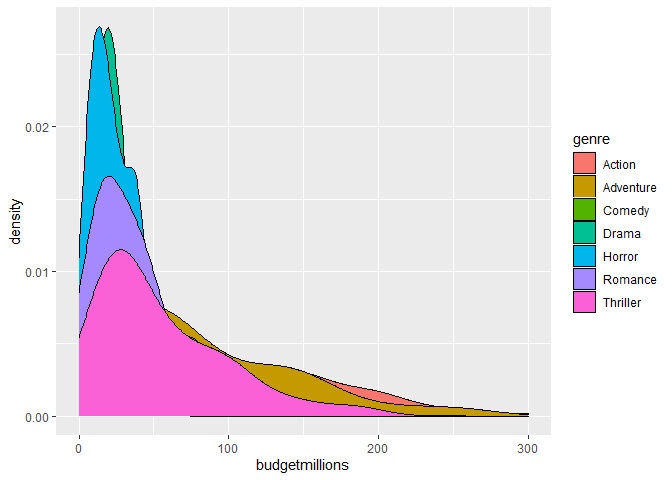

Adding new layer for limiting the yscale
----------------------------------------

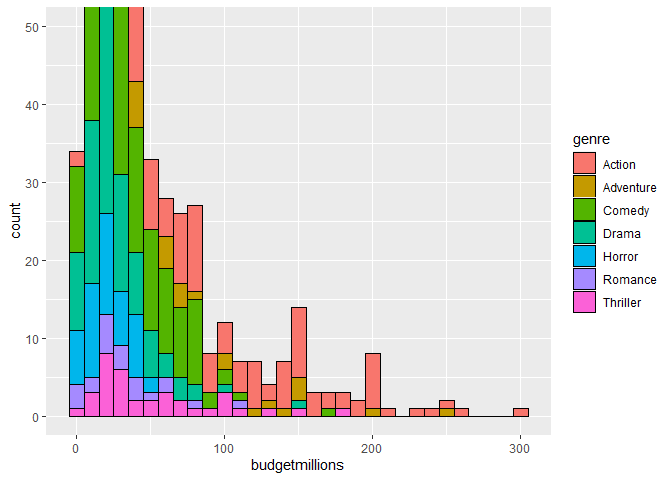

histograms with facet grid
--------------------------

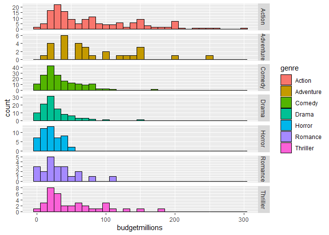

Scaling x and y coordinates
---------------------------

    ## Warning: Removed 371 rows containing missing values (geom_point).

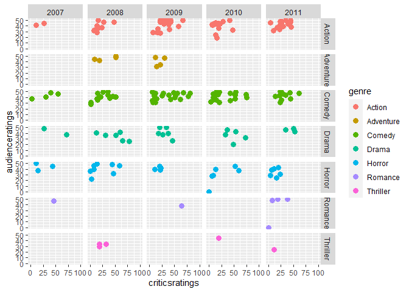

adding themes to plots
----------------------

see the difference between d & d + theme\_economist()
-----------------------------------------------------

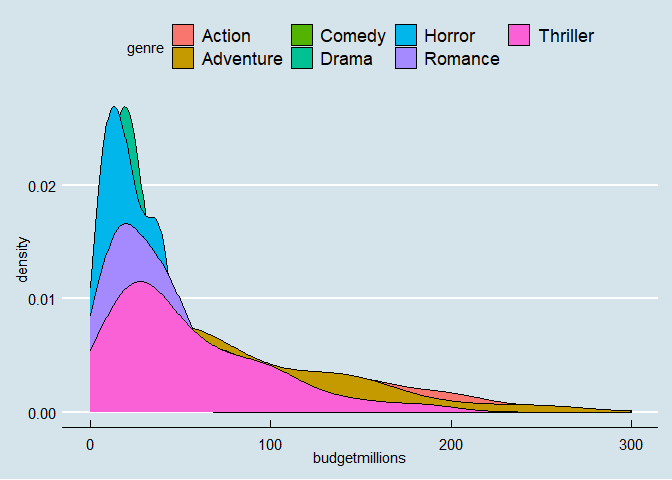
